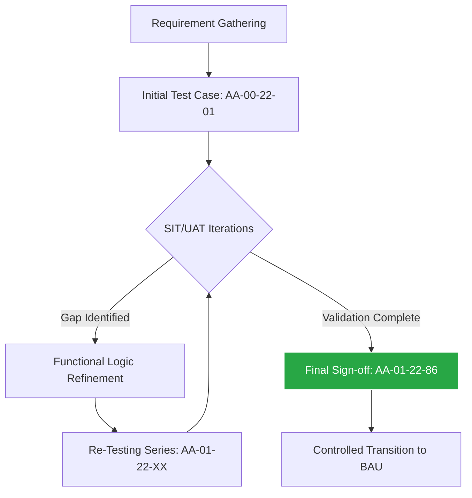

# Hi, I'm Hasan Farooqui 👋
### ERP Functional Consultant | PMP® | Lean Six Sigma Black Belt

I am an ERP specialist focused on the functional logic and architectural design of Enterprise Systems. My experience ranges from developing mobile applications to implementing Greenfield ERP solutions in highly regulated sectors. I specialize in aligning complex business requirements with scalable, audit-ready configurations in **Dynamics 365 Business Central**.

---

## 🚀 D365 Business Central Portfolio (Live Implementations)
*While my background is in large-scale ERP, these projects demonstrate my hands-on configuration mastery in D365 Business Central (MB-800 Focus).*

### 🧵 [Apparel Inventory & Logistics Optimization](https://github.com/Hasan-Farooqui-ERP/D365-Business-Central-Functional-Portfolio/tree/main/03-Apparel-Inventory-Optimization)
* **Scenario:** Scaling "Irish Heritage" (Dublin) for B2B fulfillment.
* **Key Solutions:** Multi-dimensional Variant Matrices, Bin-Mandatory warehouse logic, and Assembly BOMs with Labor Resource costing for accurate landed cost.

### 💰 [Trade Cycles: P2P & O2C Governance](https://github.com/Hasan-Farooqui-ERP/D365-Business-Central-Functional-Portfolio)
* **Focus:** End-to-end Procurement and Sales cycles, Financial G/L posting group automation, and audit-ready traceability.

---

## 🏗️ Key Project Pillars (Enterprise Experience)

* **[SAP S/4HANA Greenfield Implementation](https://github.com/Hasan-Farooqui-ERP/Greenfield-ERP-Data-Architecture/blob/main/hierarchy-logic.md)**: Managed 86+ iterative test cycles for global manufacturing rollouts.
* **[National Asset Transformation](https://github.com/Hasan-Farooqui-ERP/Greenfield-ERP-Data-Architecture)**: Led data integrity for Uisce Éireann infrastructure migrations under NIS Directive.
* **[AI & GovTech Innovation](https://github.com/Hasan-Farooqui-ERP/Product-Lifecycle-Governance)**: Deployed NLP chatbots for banking and TAT-reducing mobile solutions for government officers.
* **[Technical Foundations](https://github.com/Hasan-Farooqui-ERP/Product-Lifecycle-Governance)**: Full-stack roots in Android and CMS development with a focus on User Adoption & Hypercare.

---

## 🛠️ Tech Stack & Governance
- **ERP:** D365 Business Central, SAP S/4HANA (PS, FICO, MM).
- **PM/Ops:** PMP® Methodology, Lean Six Sigma (KPMG Black Belt), ITIL 4.
- **Methodology:** [PMO Governance Toolkit](https://github.com/Hasan-Farooqui-ERP/PMO-Governance-Toolkit) (FRDs, UAT, Change Management).
- **Data/Cloud:** SQL, Power BI, Azure Cloud, Power Platform.

---

## 📊 Logic & Validation Lifecycle

---

📫 Connect with me
LinkedIn: Hasan Farooqui

Email: farooqui.hasan@gmail.com

Location: Dublin, Ireland ☘️
